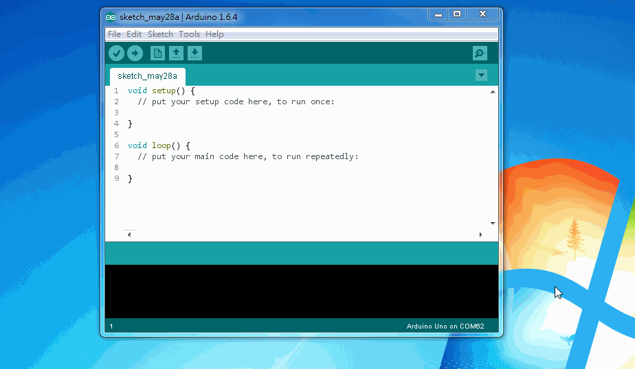
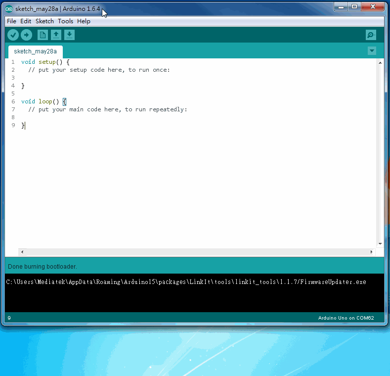

##Install LinkIt SDK 1.1.09 on Arduino IDE 1.6.4

LinkIt SDK 1.1.09(for Arduino) now provides an experimental support for Boards Manager function in Arduino IDE 1.6.4.

###Install driver
Download and install USB COM port drivers for LinkIt ONE. If you already installed LinkIt ONE USB COM port drivers before, you can skip this step. 
 * [Download driver for Windows][link2]
 * [Download driver for OS X][link1]

###Set 3rd party Boards Manager URL
Point your Arduino IDE 1.6.4 to our Boards Manager repository.
To do this, choose `File > Preferences` form IDE menu. Copy and paste following URL to the "Additional Boards Manager URLs" preferences. 

Repository URL: `http://download.labs.mediatek.com/package_mtk_linkitone_index.json`

If you have multiple Boards Manager repositories, you can seperate them with comma.

###Install LinkIt ONE SDK with Boards Manager
Make sure your computer is connected to the iternet. Then open up Boards Manager by choosing `Tools > Board > Boards Manager`. It may take several seconds for the manager to download the repository. 

There should now be an **LinkIt ONE** item appearing in the boards list. Click on it and a "Install" button appears. If there is too many items in the boards manager, set the `Type` filter to "Contributed". After installation, close and relaunch Arduino IDE.

###Relaunch Arduino IDE and update firmware
Please **close and re-launch Arduino IDE** before doing this step. After installing LinkIt ONE SDK, we can now update the firmware on LinkIt ONE to match the SDK version. The steps described here is applicable only to LinkIt SDK 1.1.09 + Arduino IDE 1.6.4.

 - Choose `Tools > Board > LinkIt ONE`
 - Then choose `Tools > Programmer > LinkIt Firmware Updater`
 - Choose `Tools > Burn Bootloader` to launch the fimrware updater

After firmware updater appears,
 - Disconnect your LinkIt ONE board from the computer
 - Set the `MS <-> UART` switch to `MS` mode
 - Click the download button in the firmware updater
 - Connect your LinkIt ONE board to the computer

It may take up to 2 minutes for the firmware to be updated. Once the update process is completed, disconnect the board from the computer, and remember to switch the `MS <-> UART` switch back to `UART` mode if you intend to upload the sketch.

And that's it! Feel free to post questions and feedback bugs to [the forum][link3].
 
[link1]: http://download.labs.mediatek.com/os-x-com-port-driver.zip
[link2]: http://download.labs.mediatek.com/windows-com-port-driver.zip
[link3]: http://labs.mediatek.com/forums/forums/list.page
